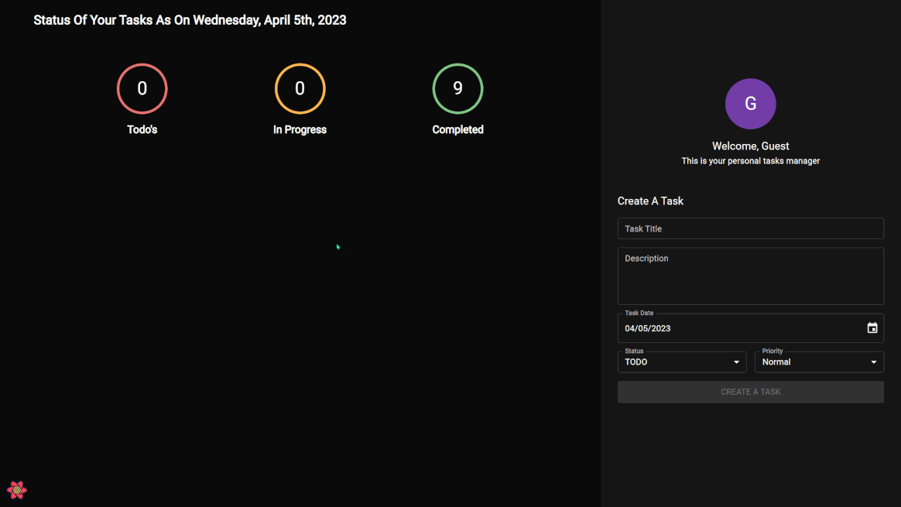

# Todo App

Full Stack Todo App with TypeScript, React, Node.js, and MySQL

## Tech Stack

<p align="left">
<a href="https://www.typescriptlang.org/" target="_blank" rel="noreferrer"></a>
<a href="https://reactjs.org/" target="_blank" rel="noreferrer"></a>
<a href="https://nodejs.org/en/" target="_blank" rel="noreferrer"></a>
<a href="https://expressjs.com/" target="_blank" rel="noreferrer"></a>
<a href="https://www.mysql.com/" target="_blank" rel="noreferrer"></a>
<a href="https://mui.com/" target="_blank" rel="noreferrer"></a>
</p>

## Features

- Task description
- Task date
- Task status
- Task prioritization

## Demo



## Software to Install

- [MySQL Community Server](https://dev.mysql.com/downloads/mysql/)
- [Git](https://git-scm.com/downloads)
- [NodeJS](https://nodejs.org/en/download/)

## Run Locally

Clone the project

```bash
  git clone https://github.com/aniltulebag/todo-app.git
```

Go to the project directory

```bash
  cd todo-app
```

Install dependencies

```bash
  # client
  cd client
  npm install

  # server
  cd server
  npm install
```

Start the server

```bash
  # client
  cd client
  npm run start

  # server
  cd server
  npm run dev
```

## License

[MIT](https://choosealicense.com/licenses/mit/)
